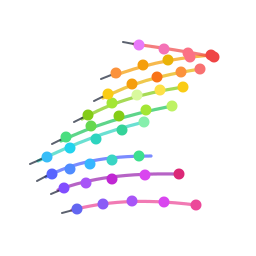

<h1 align="center">
  
  RoboFlow4D: A Lightweight Flow World Model Toward Real-Time Flow-Guided Robotic Manipulation
</h1>

<p align="center">
  Proceedings of the International Conference on Machine Learning 2026
</p>

<p align="center">
  <strong>Sixu Lin</strong><sup>1,*</sup>,
  <strong>Junliang Chen</strong><sup>2,*</sup>,
  <strong>Huaiyuan Xu</strong><sup>2,&dagger;</sup>,
  <strong>Zhuohao Li</strong><sup>3</sup>,
  <strong>Guangming Wang</strong><sup>4</sup>,
  <strong>Yixiong Jing</strong><sup>4</sup>,
  <strong>Sheng Xu</strong><sup>1</sup>,
  <strong>Runyi Zhao</strong><sup>1</sup>,
  <strong>Brian Sheil</strong><sup>4</sup>,
  <strong>Lap-Pui Chau</strong><sup>2</sup>,
  <strong>Guiliang Liu</strong><sup>1,3,&dagger;</sup>
</p>

<p align="center">
  <sup>1</sup>School of Data Science, The Chinese University of Hong Kong (Shenzhen)&nbsp;&nbsp;
  <sup>2</sup>The Hong Kong Polytechnic University<br>
  <sup>3</sup>Shenzhen Loop Area Institute&nbsp;&nbsp;
  <sup>4</sup>University of Cambridge
</p>

<p align="center">
  <sup>*</sup>Equal contribution&nbsp;&nbsp;
  <sup>&dagger;</sup>Corresponding authors
</p>

<p align="center">
  <a href="https://arxiv.org/abs/2605.17522"></a>
  <a href="https://simonlinsx.github.io/RoboFlow4D_Page/"></a>
  <a href="#citation"></a>
</p>

<p align="center">
  <a href="./assets/pipeline.png">
    
  </a>
</p>

## Overview

RoboFlow4D is a lightweight flow world model for real-time flow-guided robotic manipulation. This repository provides the flow-model pipeline: data preprocessing, model training, inference, slow-fast flow-guided action evaluation, and visualization.

## Repository Scope

- `process_data/`: preprocessing for both simulation and real-world data.
- `3DFlowModel/`: flow model definition, training and inference.
- `action_policy/`: flow-conditioned action-policy training and evaluation.
- `visualization/`: visualization of the predicted point flow in 3D space.
- `utils/`: HDF5 inspection, trajectory filtering, metric checks, and helper scripts.

## Environment

Create the Python environment from the flow-model environment file:

```bash
conda env create -f 3DFlowModel/environment.yml
conda activate roboflow
```

After cloning the repository, initialize third-party code submodules:

```bash
git submodule update --init --recursive
```

The preprocessing scripts expect optional external repositories/checkpoints depending on the dataset:

- `SpaTrackerV2/` for 3D point trajectories.
- `Grounded-SAM-2/` for segmentation-guided query point selection.

RGB-D metric calibration is optional. It is needed when you want metric-scale point flows for motion planning, model-based control, or metric-scale training. Dataset-specific requirements are summarized in the preprocessing section.

## Data Processing

The processed HDF5 files use a compact training-facing convention:

- `point_traj`: original SpaTracker-scale 3D point flow.
- `point_traj_metric`: optional stage-aligned metric-scale point flow.

### Raw Data Sources

Start from the original dataset releases or official collection tools, then run the conversion scripts below.

- LIBERO: download demonstration HDF5 files from the official [LIBERO repository](https://github.com/Lifelong-Robot-Learning/LIBERO), using `benchmark_scripts/download_libero_datasets.py` or its Hugging Face option.
- ManiSkill: follow the official [demonstration download](https://maniskill.readthedocs.io/en/latest/user_guide/datasets/demos.html) and [trajectory replay/conversion](https://maniskill.readthedocs.io/en/latest/user_guide/datasets/replay.html) documentation to obtain HDF5 demonstrations with the desired observations.
- DROID: use the official [DROID dataset](https://droid-dataset.github.io/) / TFDS release as the raw data source.
- Custom real-world videos: provide your own RGB videos. Metric calibration additionally requires synchronized depth, intrinsics, and camera-to-robot calibration.

For LIBERO preprocessing:

```bash
python process_data/process_libero_hdf5.py \
  --input_dirs /path/to/libero_hdf5_dir \
  --out_root /path/to/processed_tracks_root \
  --prompt_from_text \
  --device cuda
```

If you only need SpaTracker-scale flow training, stop here and train with `--traj_key point_traj`.

Optional: to add simulator RGB-D metric calibration and build metric trajectories:

```bash
python process_data/build_libero_metric_tracks.py \
  --tracks_root /path/to/processed_tracks_root \
  --libero_root /path/to/LIBERO \
  --out_root /path/to/clean_metric_tracks \
  --overwrite
```

This wrapper replays simulator depth, calibrates SpaTracker trajectories to metric coordinates, applies stage-level alignment, and exports the compact `point_traj` / `point_traj_metric` training keys. The lower-level scripts remain available for debugging or ablations.

For ManiSkill preprocessing:

```bash
python process_data/process_maniskill_hdf5.py \
  --input_dirs /path/to/maniskill_hdf5_dir \
  --out_root /path/to/maniskill_tracks \
  --device cuda
```

Optional: to add ManiSkill RGB-D metric calibration:

```bash
python process_data/patch_maniskill_rgbd_to_tracks.py \
  --tracks /path/to/maniskill_tracks/task_name/task_name_tracks.hdf5 \
  --rgbd_h5 /path/to/maniskill_rgbd_replay.h5 \
  --overwrite
```

For DROID datasets:

```bash
python process_data/process_droid.py \
  --droid_dir /path/to/droid_tfds \
  --out_root /path/to/droid_tracks
```

For custom real-world videos:

```bash
python process_data/mp4_to_minimal_real_hdf5.py \
  --input_dir /path/to/real_videos \
  --out_dir /path/to/real_hdf5

python process_data/process_arm_real.py \
  --input_dirs /path/to/real_hdf5 \
  --out_root /path/to/real_tracks
```

DROID, ManiSkill, and custom real-world preprocessing use gripper tracking by default. Pass `--prompt` only when tracking a non-gripper target. DROID and custom real-world preprocessing produce SpaTracker-scale `point_traj` by default. Metric calibration is optional and requires synchronized RGB-D, intrinsics, and camera-to-robot calibration.

The main dataset keys and common preprocessing commands are summarized above.

## Training

Train with the desired trajectory key. Native SpaTracker-scale training uses `--traj_key point_traj`; metric-scale training uses `--traj_key point_traj_metric`.

```bash
python 3DFlowModel/train_flow_model.py \
  --flow_root /path/to/clean_metric_tracks \
  --traj_key point_traj_metric \
  --save_dir /path/to/checkpoints
```

For multi-GPU training, launch the same script with `torchrun`.

## Inference

Run HDF5 inference with the same trajectory mode used in training:

```bash
python 3DFlowModel/predict_flow_hdf5.py \
  --hdf5_root /path/to/clean_metric_tracks \
  --ckpt /path/to/siglip_flow_futureK_best.pt \
  --out_key pre_point_traj_metric \
  --debug_tracks_dir outputs/debug_pred_tracks_metric \
  --no_query_points \
  --overwrite
```

`k_steps` and `num_points` are inferred from the checkpoint by default. The debug projection key is selected automatically from the output key and the available calibration data.

## Action Policy Learning

Train a flow-conditioned diffusion policy from tracks that already contain predicted flow:

```bash
PYTHONPATH=action_policy python action_policy/train/train_policy_dp_ema.py \
  --flow_root /path/to/libero_tracks_with_pred_flow \
  --save_dir /path/to/action_policy_ckpts
```

Evaluate the trained action policy:

```bash
PYTHONPATH=action_policy python action_policy/eval/eval_libero_dp.py \
  --suit_type libero_spatial \
  --action_ckpt /path/to/action_policy_ckpts/best_action_policy_ema.pt \
  --ckpt /path/to/siglip_flow_futureK_best.pt \
  --video_dir outputs/action_policy_rollouts
```

In this evaluator, the flow model is the slow planner and the diffusion policy is the fast controller. The planner predicts a future point-flow plan from recent RGB observations, and the controller executes short action chunks conditioned on the current observation and that flow plan.

## LIBERO Task-4 Local Runbook

This section records a minimal end-to-end LIBERO spatial task run that has been tested on a single 16 GB laptop GPU. The example task is:

```text
task_id=4
pick up the black bowl in the top drawer of the wooden cabinet and place it on the plate
```

The local paths below assume:

```text
RoboFlow4D: /home/penglin/projects/RoboFlow4D
LIBERO:     /home/penglin/projects/LIBERO
```

### Environment notes

Activate the project environment and expose LIBERO to Python:

```bash
cd ~/projects/RoboFlow4D
conda activate roboflow
export PYTHONPATH=/home/penglin/projects/LIBERO:$PYTHONPATH
export MUJOCO_GL=egl
```

For LIBERO simulator replay, the environment also needs robosuite, bddl, future, gym, and a robosuite-compatible MuJoCo version. If `robosuite` fails with MuJoCo API errors such as missing `mj_fullM`, use MuJoCo 2.3.x rather than the newest MuJoCo release.

The simulator import check should end with `LIBERO sim deps OK`:

```bash
python -c "import robosuite, bddl; from libero.libero.envs import OffScreenRenderEnv; print('LIBERO sim deps OK')"
```

### 1. Build metric tracks

Start from the processed SpaTracker HDF5 root and build compact metric tracks:

```bash
python process_data/build_libero_metric_tracks.py \
  --tracks_root data/libero_one_tracks \
  --libero_root /home/penglin/projects/LIBERO \
  --out_root data/clean_metric_tracks \
  --overwrite
```

Expected key outputs inside each selected demo:

```text
point_traj          (T, 100, 3)
point_traj_metric   (T, 100, 3)
actions             (T, 7)
robot_states        (T, 8)
frames_rgb          (T, 3, 128, 128)
```

### 2. Train the metric flow model

For a 16 GB GPU, use a small per-step batch and gradient accumulation:

```bash
python 3DFlowModel/train_flow_model.py \
  --flow_root data/clean_metric_tracks \
  --traj_key point_traj_metric \
  --save_dir checkpoints/libero_one_point_traj_metric \
  --batch_size 1 \
  --accum_steps 64 \
  --fp16 \
  --workers 2
```

The best checkpoint is saved as `siglip_flow_futureK_best.pt` under the generated checkpoint directory. In the tested task-4 run, the checkpoint used:

```text
k_steps=20
num_points=100
model_dim=768
num_layers=10
num_heads=12
```

### 3. Run HDF5 flow inference

Write predicted metric flow back into the clean track HDF5:

```bash
python 3DFlowModel/predict_flow_hdf5.py \
  --hdf5_root data/clean_metric_tracks \
  --ckpt checkpoints/libero_one_point_traj_metricFlow_k20_n100_trajpoint_traj_metric_taskauto_lr5e-05_final_lr5e-06_bs1_align_weight0.5_p_uncond0.2_snr_gamma0.0_cond_kframes4_train_noise_timesteps100_motion_moduleFalse_query_pointsFalse/siglip_flow_futureK_best.pt \
  --out_key pre_point_traj_metric \
  --debug_tracks_dir outputs/debug_pred_tracks_metric \
  --no_query_points \
  --overwrite \
  --window_bs 8 \
  --amp
```

Successful inference should report that all demos were written. The expected prediction key is:

```text
pre_point_traj_metric  (T, 20, 100, 3)
```

The debug PNGs in `outputs/debug_pred_tracks_metric/` project the predicted metric flow back onto the RGB image. Good debug images should show the colored tracks concentrated near the manipulated object and robot interaction region, not flying across the whole image.

### 4. Prepare action-policy tracks

The action policy requires wrist camera frames:

```text
wrist_frames  (T, 3, H, W)
```

If `data/clean_metric_tracks` does not contain `wrist_frames`, copy them from the original LIBERO raw HDF5 key `obs/eye_in_hand_rgb` and transpose from `THWC` to `TCHW`. For this task, the raw wrist frames are in:

```text
data/libero_one_raw/pick_up_the_black_bowl_in_the_top_drawer_of_the_wooden_cabinet_and_place_it_on_the_plate_demo.hdf5
```

For this local task, the following one-off patch copies wrist camera images into the clean metric HDF5:

```bash
python - <<'PY'
from pathlib import Path
import h5py
import numpy as np

raw = Path("data/libero_one_raw/pick_up_the_black_bowl_in_the_top_drawer_of_the_wooden_cabinet_and_place_it_on_the_plate_demo.hdf5")
clean = Path("data/clean_metric_tracks/pick_up_the_black_bowl_in_the_top_drawer_of_the_wooden_cabinet_and_place_it_on_the_plate_demo/pick_up_the_black_bowl_in_the_top_drawer_of_the_wooden_cabinet_and_place_it_on_the_plate_demo_tracks.hdf5")

with h5py.File(raw, "r") as fr, h5py.File(clean, "a") as fc:
    for demo in sorted(fc["data"].keys()):
        g = fc["data"][demo]
        if "wrist_frames" in g:
            print(demo, "already has wrist_frames", g["wrist_frames"].shape)
            continue
        arr = fr[f"data/{demo}/obs/eye_in_hand_rgb"][...]
        arr = np.transpose(arr, (0, 3, 1, 2)).copy()  # THWC -> TCHW
        g.create_dataset("wrist_frames", data=arr, chunks=(1,) + arr.shape[1:], compression="lzf")
        print(demo, "created wrist_frames", arr.shape, arr.dtype)
PY
```

A quick data-read check should show nonzero samples and these tensor shapes:

```bash
PYTHONPATH=action_policy python -c "from train.train_policy_dp_ema import FutureKDataset; ds=FutureKDataset('data/clean_metric_tracks',20,100,flow_key='pre_point_traj_metric',target_flow_key='point_traj_metric'); print('samples', len(ds)); x=ds[0]; print({k:(v.shape if hasattr(v,'shape') else type(v).__name__) for k,v in x.items()})"
```

Expected output:

```text
samples 499
images        torch.Size([3, 256, 256])
wrist_images  torch.Size([3, 256, 256])
proprios      torch.Size([8])
flows         torch.Size([20, 100, 3])
target_flows  torch.Size([20, 100, 3])
actions       torch.Size([20, 7])
```

### 5. Smoke-test action policy training

Before a long policy run, train for one epoch:

```bash
PYTHONPATH=action_policy python action_policy/train/train_policy_dp_ema.py \
  --flow_root data/clean_metric_tracks \
  --save_dir checkpoints/action_policy_libero_spatial_task4_metric_smoke \
  --batch_size 2 \
  --accum_steps 32 \
  --epochs 1 \
  --fp16 \
  --workers 0
```

The smoke test should save:

```text
checkpoints/action_policy_libero_spatial_task4_metric_smoke/best_action_policy_ema.pt
checkpoints/action_policy_libero_spatial_task4_metric_smoke/latest_action_policy_ema.pt
```

### 6. Train the action policy

If the smoke test passes, run a longer action-policy training job:

```bash
PYTHONPATH=action_policy python action_policy/train/train_policy_dp_ema.py \
  --flow_root data/clean_metric_tracks \
  --save_dir checkpoints/action_policy_libero_spatial_task4_metric \
  --batch_size 4 \
  --accum_steps 16 \
  --epochs 100 \
  --fp16 \
  --workers 2 \
  --latest_save_frequency 5
```

If the 16 GB GPU runs out of memory, lower the batch size and increase accumulation:

```bash
--batch_size 2 --accum_steps 32
```

or:

```bash
--batch_size 1 --accum_steps 64
```

The main validation metric to watch is `val_l1`, the action prediction error. Some epoch-to-epoch noise is normal; the useful signal is the overall downward trend.

### 7. Evaluate task 4

Evaluate the trained EMA policy on the matching LIBERO spatial task:

```bash
export PYTHONPATH=action_policy:/home/penglin/projects/LIBERO:$PYTHONPATH
export MUJOCO_GL=egl

python action_policy/eval/eval_libero_dp.py \
  --suit_type libero_spatial \
  --task_ids 4 \
  --task_num 10 \
  --eval_num_init_states 5 \
  --num_envs 1 \
  --action_ckpt checkpoints/action_policy_libero_spatial_task4_metric/best_action_policy_ema.pt \
  --ckpt checkpoints/libero_one_point_traj_metricFlow_k20_n100_trajpoint_traj_metric_taskauto_lr5e-05_final_lr5e-06_bs1_align_weight0.5_p_uncond0.2_snr_gamma0.0_cond_kframes4_train_noise_timesteps100_motion_moduleFalse_query_pointsFalse/siglip_flow_futureK_best.pt \
  --video_dir outputs/action_policy_rollouts_task4 \
  --flow_ddim_steps 10 \
  --action_ddim_steps 16
```

For a first check, keep `--eval_num_init_states` small. Increase it only after the evaluator launches, renders videos, and completes at least one rollout.

In the tested 4-demo task-4 run, evaluation completed successfully and saved rollout videos, but the first 5 initial states had `success_rate=0.0`. This means the simulator, checkpoints, closed-loop policy, and video writer all ran, but the policy did not solve the long-horizon task. With only four demonstrations, this is expected: the offline `val_l1` can improve while closed-loop rollouts still fail due to limited data coverage and compounding errors.

The generated videos are useful for diagnosis. Example output path:

```text
outputs/action_policy_rollouts_task4/libero_spatial/task04--init000--fail--success=0of1--pick_up_the_black_bowl_in_the_top_drawer_of_the_wooden_cabinet_and_place_it_on_the_plate.mp4
```

### 8. Visualize predicted metric flow

After HDF5 inference, generate an interactive 3D preview of the predicted metric flow. Start with a small preview instead of generating every possible start frame:

```bash
python visualization/save_seg_all_starts_to_goal_3d_html.py \
  --flow_root data/clean_metric_tracks \
  --out_dir outputs/html/predicted_flow_task4_preview \
  --traj_key pre_point_traj_metric \
  --demo_id demo_12 \
  --start_stride 20 \
  --max_start_frames 5 \
  --verbose
```

This tested preview generated 8 HTML files. The main page is:

```text
outputs/html/predicted_flow_task4_preview/pick_up_the_black_bowl_in_the_top_drawer_of_the_wooden_cabinet_and_place_it_on_the_plate_demo/demo_demo_12/all_stages_3d.html
```

Serve the preview locally:

```bash
cd ~/projects/RoboFlow4D/outputs/html/predicted_flow_task4_preview
python -m http.server 8899
```

Then open:

```text
http://localhost:8899/
```

For a full visualization pass over all available demos/start frames, remove the preview limits:

```bash
python visualization/save_seg_all_starts_to_goal_3d_html.py \
  --flow_root data/clean_metric_tracks \
  --out_dir outputs/html/predicted_flow_task4_full \
  --traj_key pre_point_traj_metric \
  --verbose
```

## Visualization

Create an interactive 3D HTML demo for predicted point flow after inference:

```bash
python visualization/save_seg_all_starts_to_goal_3d_html.py \
  --flow_root /path/to/tracks_with_predictions.hdf5 \
  --out_dir outputs/html/predicted_flow \
  --traj_key pre_point_traj_metric
```

Use `--traj_key pre_point_traj` for native SpaTracker-scale predictions, or the corresponding prediction key you wrote with `--out_key` during inference.

Serve the generated HTML locally:

```bash
cd outputs/html/predicted_flow
python -m http.server 8899
```

Then open `http://localhost:8899/` in a browser.

## Acknowledgements

This code builds on several excellent open-source projects and datasets, including [SpaTrackerV2](https://github.com/henry123-boy/SpaTrackerV2), [VGGT](https://github.com/facebookresearch/vggt), [Grounded-SAM2](https://github.com/IDEA-Research/Grounded-SAM-2), [LIBERO](https://github.com/Lifelong-Robot-Learning/LIBERO), [ManiSkill](https://github.com/haosulab/ManiSkill), [robosuite](https://github.com/ARISE-Initiative/robosuite), [SigLIP](https://huggingface.co/docs/transformers/model_doc/siglip), [DINOv2](https://github.com/facebookresearch/dinov2), [PyTorch](https://pytorch.org/), and [diffusers](https://github.com/huggingface/diffusers).

## Citation

If you find this project useful, please cite:

```bibtex
@article{lin2026roboflow4d,
  title={RoboFlow4D: A Lightweight Flow World Model Toward Real-Time Flow-Guided Robotic Manipulation},
  author={Lin, Sixu and Chen, Junliang and Xu, Huaiyuan and Li, Zhuohao and Wang, Guangming and Jing, Yixiong and Xu, Sheng and Zhao, Runyi and Sheil, Brian and Chau, Lap-Pui and others},
  journal={arXiv preprint arXiv:2605.17522},
  year={2026}
}
```
