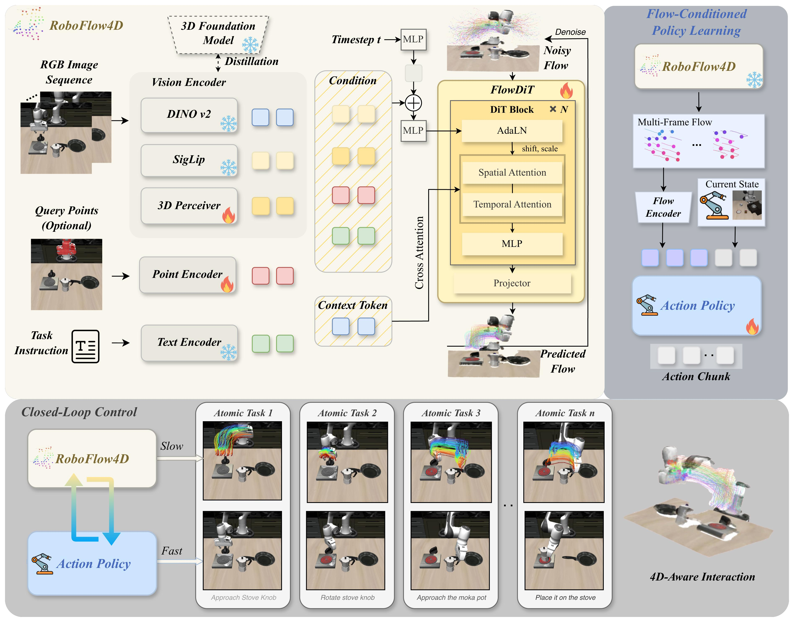

<h1 align="center">RoboFlow4D</h1>

<p align="center">
  <strong>RoboFlow4D: A Lightweight Flow World Model Toward Real-Time Flow-Guided Robotic Manipulation</strong>
</p>

<p align="center">
  Proceedings of the International Conference on Machine Learning 2026
</p>

<p align="center">
  <strong>Sixu Lin</strong><sup>1,*</sup>,
  <strong>Junliang Chen</strong><sup>2,*</sup>,
  <strong>Huaiyuan Xu</strong><sup>2,&dagger;</sup>,
  <strong>Zhuohao Li</strong><sup>3</sup>,
  <strong>Guangming Wang</strong><sup>4</sup>,
  <strong>Yixiong Jing</strong><sup>4</sup>,
  <strong>Sheng Xu</strong><sup>1</sup>,
  <strong>Runyi Zhao</strong><sup>1</sup>,
  <strong>Brian Sheil</strong><sup>4</sup>,
  <strong>Lap-Pui Chau</strong><sup>2</sup>,
  <strong>Guiliang Liu</strong><sup>1,3,&dagger;</sup>
</p>

<p align="center">
  <sup>1</sup>School of Data Science, The Chinese University of Hong Kong (Shenzhen)&nbsp;&nbsp;
  <sup>2</sup>The Hong Kong Polytechnic University<br>
  <sup>3</sup>Shenzhen Loop Area Institute&nbsp;&nbsp;
  <sup>4</sup>University of Cambridge
</p>

<p align="center">
  <sup>*</sup>Equal contribution&nbsp;&nbsp;
  <sup>&dagger;</sup>Corresponding authors
</p>

<p align="center">
  
  
  <a href="./pipeline.pdf"></a>
  <a href="#citation"></a>
  
</p>

<p align="center">
  <a href="./pipeline.pdf">
    
  </a>
</p>

## Overview

RoboFlow4D is a lightweight flow world model for real-time flow-guided robotic manipulation. It models dynamic 3D point flow and uses predicted flow as a compact intermediate representation for downstream manipulation policies.

This public repository currently hosts the project README and paper assets. Code, training scripts, model checkpoints, and detailed setup instructions will be released in a later update.

## Pipeline

RoboFlow4D follows a flow-centered manipulation pipeline:

1. Track task-relevant scene points from robot demonstrations.
2. Lift tracked points into 3D trajectories.
3. Train a lightweight 3D flow world model.
4. Predict future point flow from current observations.
5. Condition robot policies on predicted flow for manipulation.

The full pipeline figure is available as [pipeline.pdf](./pipeline.pdf).

## Release Status

- README and pipeline figure: released
- Paper link: coming soon
- Code: coming soon
- Checkpoints and data processing instructions: coming soon

## Acknowledgements

RoboFlow4D builds on several excellent open-source projects and benchmark suites, including SpaTrackerV2, VGGT, Grounded-SAM-2, GroundingDINO, SAM 2, LIBERO, ManiSkill, SigLIP / Big Vision, PyTorch, and the broader robotics and embodied AI open-source community.

## Citation

If you find this project useful, please cite:

```bibtex
@inproceedings{roboflow4d2026,
  title={RoboFlow4D: A Lightweight Flow World Model Toward Real-Time Flow-Guided Robotic Manipulation},
  author={Lin, Sixu and Chen, Junliang and Xu, Huaiyuan and Li, Zhuohao and Wang, Guangming and Jing, Yixiong and Xu, Sheng and Zhao, Runyi and Sheil, Brian and Chau, Lap-Pui and Liu, Guiliang},
  booktitle={Proceedings of the International Conference on Machine Learning},
  year={2026}
}
```
